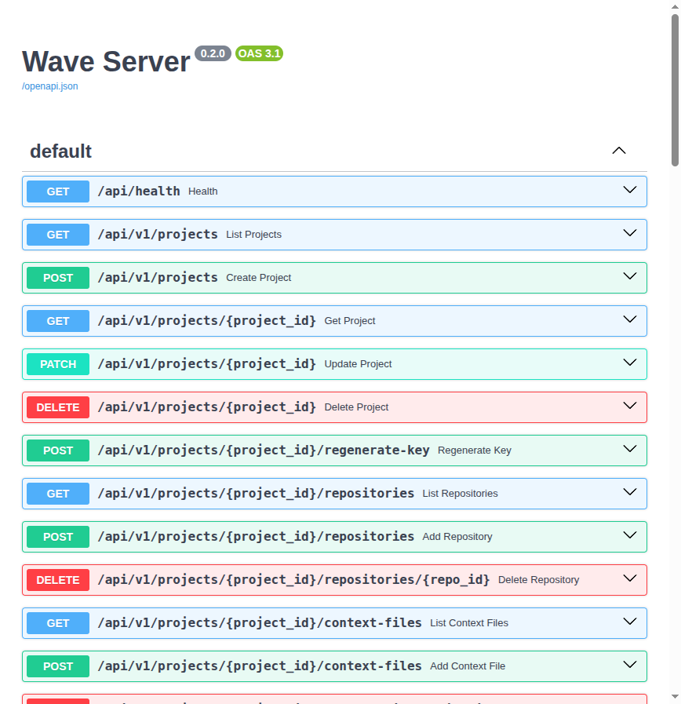
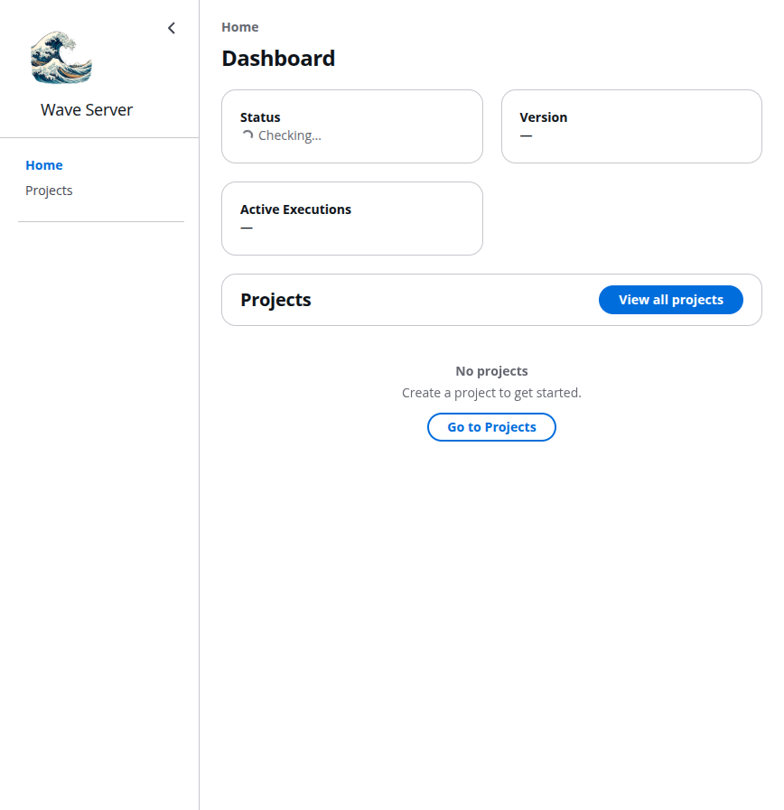

# What I've Built with AI Coding Tools

**Hendrik — [github.com/rHedBull](https://github.com/rHedBull)**

I don't just use AI coding tools — I build them. Over the past few months I've shipped 12+ open-source projects, most built with and for [pi](https://github.com/badlogic/pi-mono) (an open-source AI coding agent) and Claude Code. Here's the highlight reel.

---

## The Projects

### 🌊 [wave-server](https://github.com/rHedBull/wave-server) — Multi-Agent Wave Orchestration Server *(36+ PRs, 650 tests)*

**This repo.** REST API and execution engine for multi-agent wave orchestration. Parses plan markdown into DAG-scheduled tasks, spawns Claude Code or pi worker subprocesses in isolated git worktrees, and tracks execution state via SQLite.

**What it does:** You submit a structured plan (waves → foundation/features/integration phases → tasks with dependencies). The server validates the DAG, creates git worktrees for parallel feature isolation, spawns specialized agents (worker, test-writer, verifier) for each task, streams events in real-time, and merges results back. Includes verify-fix loops, rate-limit retry detection, model selection per agent type, and a Next.js dashboard.

**Why I built it:** The previous version (pi-wave) was a TypeScript pi extension that ran inside the agent process. I needed a standalone server that any client could talk to — decouple orchestration from the agent runtime. The result: a Python FastAPI service with 650 tests, live eval tests that run real Claude Code subprocesses, and a clean REST API.

**Architecture:**
```
Plan (markdown) → DAG Validation → Wave Executor
                                      │
                    ┌─────────────────┼─────────────────┐
                    ▼                 ▼                  ▼
              Foundation        Features (parallel)   Integration
              (sequential)      (git worktree each)   (sequential)
                    │                 │                  │
                    ▼                 ▼                  ▼
              Agent Runner      Agent Runner          Agent Runner
              (pi / claude)     (pi / claude)         (pi / claude)
                    │                 │                  │
                    ▼                 ▼                  ▼
              Events → SQLite → REST API → Dashboard
```

### 🔮 [Prism](https://github.com/rHedBull/prism) — 3D Codebase Architecture Visualizer *(98+ commits)*

Static analysis + Three.js visualization. Builds call graphs from Python/TypeScript codebases using tree-sitter, organizes nodes into C4-style layers, renders force-directed 3D graphs, computes structural diffs between git refs, and enriches edges with semantic meaning via Claude.

**Why I built it:** Reading a new codebase is the bottleneck. I wanted to *see* architecture — not just read it.

### 🤖 [auto-agents](https://github.com/rHedBull/auto-agents) — Automated PR Reviews

GitHub Actions workflow that runs pi-powered PR reviews on every pull request. Set up once with an API key, reuse across all repos. Costs ~$0.05–0.30 per review.

### 🧠 [pi-episodic-memory](https://github.com/rHedBull/pi-episodic-memory) — Semantic Memory Across Sessions

100% local episodic memory using vector embeddings (Transformers.js + SQLite). Indexes all past conversations so the agent can search "how did we solve X before?" by meaning, not keywords. Cross-project, date-filtered, no API calls.

### 🔒 [pi-permissions](https://github.com/rHedBull/pi-permissions) — Permission Modes

Claude Code-style permission system for pi. Four escalating modes from "confirm everything" to "full auto", with catastrophic command blocking.

### 🔍 [pi-lsp](https://github.com/rHedBull/pi-lsp) — LSP Code Navigation

Gives AI agents compiler-grade code intelligence instead of grep. Go-to-definition, find-references, hover types — the same tools IDEs use, available to the agent.

### 📋 [point-labeler](https://github.com/rHedBull/point-labeler) — Industrial LiDAR Annotation *(27+ commits)*

Interactive segmentation and annotation toolkit for industrial LiDAR point clouds. RANSAC primitive fitting → interactive annotation → equipment description pipeline.

### 🔐 [redaction-toolkit](https://github.com/rHedBull/redaction-toolkit) — Privacy-Safe AI Document Handling

Local document redaction using spaCy NER so you can safely share sensitive documents with AI assistants. Redact → work with AI → restore.

### 🎓 [ai-trainer](https://github.com/rHedBull/ai-trainer) — Neural Network Training Coach

Claude Code plugin that guides you through training Transformers — diagnostics, scaling laws, hyperparameter sweeps, experiment design.

---

## My Secret Hacks for AI Coding Tools

### 1. Build the agent's toolkit, not just your app

Most people prompt harder. I build **extensions that make the agent smarter**. LSP tools so it doesn't grep blindly. Episodic memory so it remembers past decisions. Permission systems so I can trust it to run autonomously. The compound effect is massive — every extension makes every future session better.

### 2. Decompose before you delegate

The single biggest mistake: giving an AI agent a vague, massive task. wave-server exists because I learned that the right abstraction is a **DAG of focused tasks with explicit dependencies**. One agent per feature, each in its own git worktree, with clear specs. Parallelism comes free.

### 3. Make the agent its own reviewer

I wire in automated review at every stage. auto-agents runs PR reviews on every push. wave-server has a verify-fix loop — the verifier checks results, and if issues are found, a fix agent is spawned automatically before failing. The pattern: **generate → verify → fix → re-verify**. Never ship the first output.

### 4. Context is the bottleneck, not intelligence

The model is smart enough. The problem is always what it can see. That's why I built Prism (visual architecture), pi-lsp (compiler-grade navigation), and episodic memory (past conversations). Every tool I build is really about **giving the agent better eyes**.

### 5. Be your own first user — immediately

I use wave-server to orchestrate my own development. I use pi-lsp while coding pi-lsp. Every extension I ship, I've dogfooded in real projects first. If it doesn't make *my* workflow faster, it doesn't ship.

### 6. Local-first, privacy-aware

redaction-toolkit exists because real work involves real data. Episodic memory runs 100% locally. I design for the constraint that sensitive data can never leave the machine.

### 7. Orchestrate agents like microservices

Don't build one god-agent. Build specialized agents (worker, test-writer, verifier) and orchestrate them. wave-server's architecture: foundation tasks set up shared contracts → parallel feature agents each in their own worktree → merge → integration tasks verify everything works. Each agent is small, focused, and replaceable.

---

## The Questions

### Agency — What's the last thing nobody asked me to do but I did it?

Built an entire ecosystem of AI agent infrastructure. Nobody asked me to build episodic memory, LSP integration, permission systems, a 3D architecture visualizer, or a multi-agent orchestration server. I used the tools, saw what was missing, and built it. 12+ packages in ~2 months. The wave-server alone — DAG-based parallel execution with git worktree isolation, verify-fix loops, real-time event streaming — represents a fundamentally different way to orchestrate AI development. That idea didn't come from a ticket.

### See Problems — How do I act?

I build tools. When I noticed AI agents grep blindly through codebases, I built pi-lsp. When I realized sessions have amnesia, I built episodic memory. When I saw that PR reviews were the weakest link, I built auto-agents. When I found myself manually coordinating multi-feature changes, I built wave-server. When agent subprocesses hung under uvicorn, I traced it to process group signal interference and fixed it with `start_new_session=True`. My default response to friction is: **diagnose it, fix it, ship it**.

### Obsession to Learn — What has been the last thing I learned?

How `asyncio.create_subprocess_exec` inherits process groups from the parent, and how uvicorn's signal handlers propagate to child processes — causing pi/claude CLI tools to hang indefinitely. Diagnosed by systematically isolating variables (event loop type, stdout capture method, process group) until finding that `start_new_session=True` was the fix. Before that: building a semantic search engine with Transformers.js + sqlite-vec. Before that: tree-sitter AST parsing for call graphs.

### First Customer — How do I test things?

650 tests for wave-server. Live eval tests that spawn real Claude Code subprocesses and verify file creation. I use everything I build, daily. wave-server orchestrates my own development. pi-lsp navigates my own code. Prism visualizes my own repos. If something is clunky when I use it, I fix it before anyone else sees it.

### Eye for Good Products — What product inspires me and why?

**pi** (the coding agent I build extensions for). It's opinionated in the right ways — extensible through a clean package system, transparent about what the agent sees and does, and designed to be augmented rather than forked. The extension model (tools, agents, prompt templates, skills) is the right abstraction. It trusts its community to build what's missing. I've proven that trust is well-placed.

### What Makes Me Different?

I don't use AI coding tools — I **extend them**. Most applicants will show apps they built *with* Cursor or Claude Code. I show infrastructure I built *for* AI agents: a multi-agent orchestration server with 650 tests, memory systems, permission models, code navigation, architecture visualization, automated review pipelines. I understand these tools from the inside because I've built their missing pieces. And I ship fast — 12+ packages in 2 months, all used in production by me daily.

---

## Screenshots

### API (45 endpoints)


### Dashboard


### Demo Script
Run `./demo.sh` to see a full execution flow — creates a project, uploads a plan, starts an execution, and watches the agent create files on an isolated git branch.

---

## Links

- GitHub: [github.com/rHedBull](https://github.com/rHedBull)
- Key repos: [wave-server](https://github.com/rHedBull/wave-server) · [Prism](https://github.com/rHedBull/prism) · [auto-agents](https://github.com/rHedBull/auto-agents) · [pi-episodic-memory](https://github.com/rHedBull/pi-episodic-memory) · [pi-permissions](https://github.com/rHedBull/pi-permissions) · [pi-lsp](https://github.com/rHedBull/pi-lsp) · [redaction-toolkit](https://github.com/rHedBull/redaction-toolkit)
